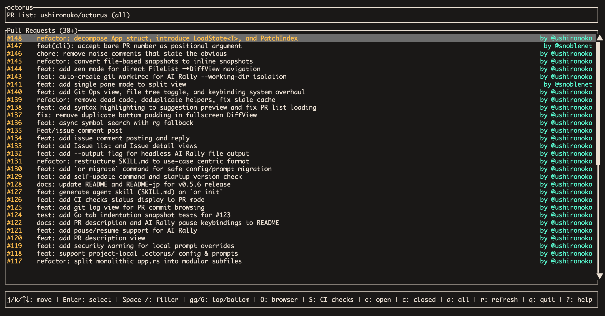
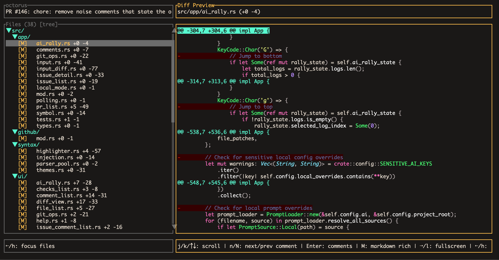
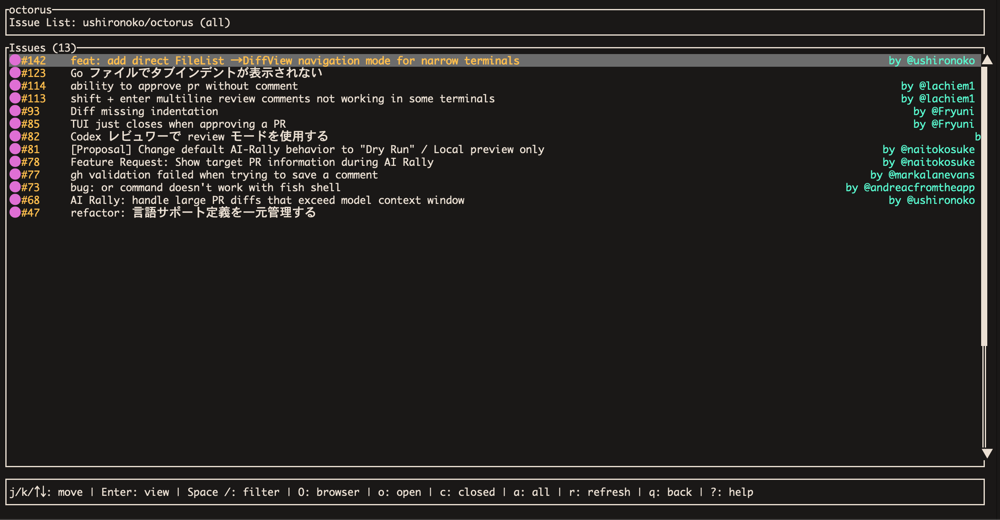
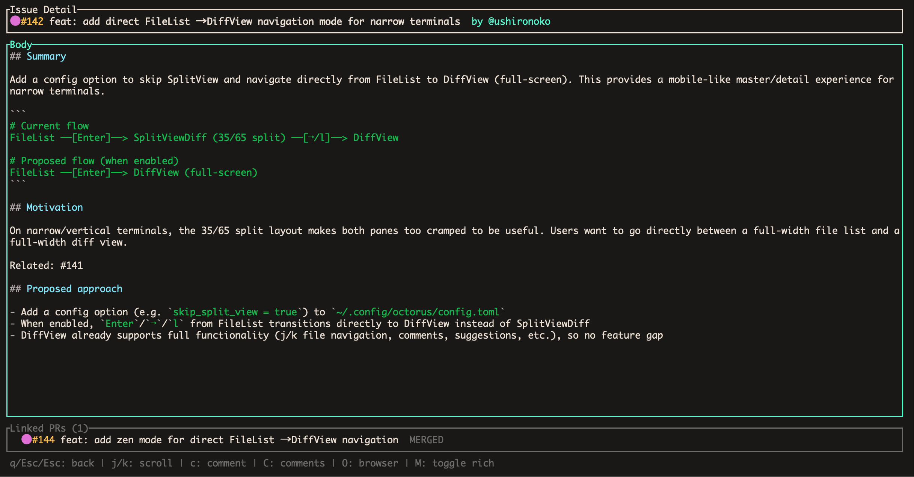
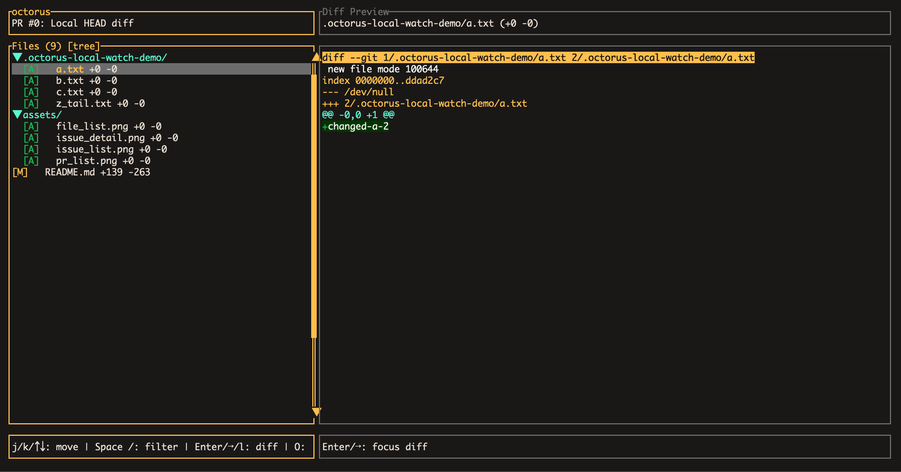
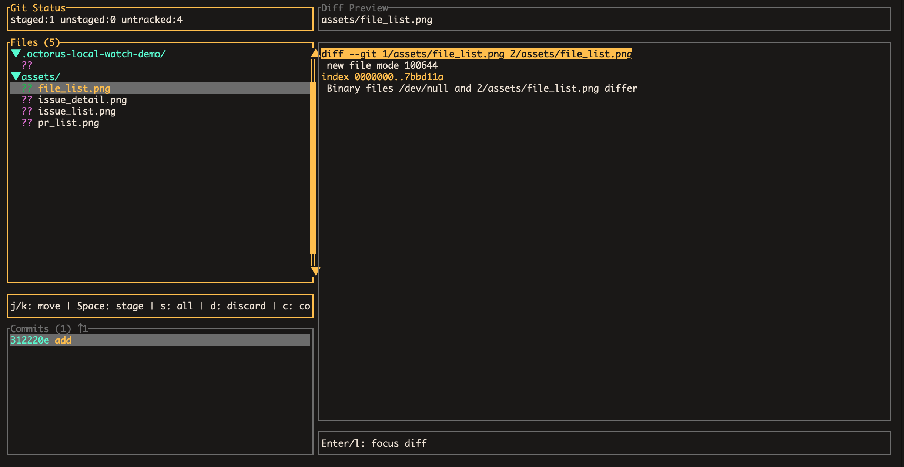
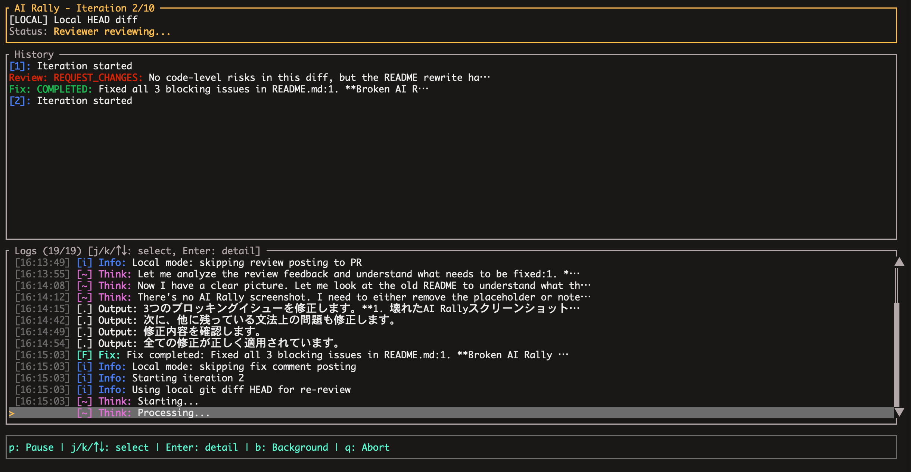

# octorus

<p align="center">
  
</p>

[](https://crates.io/crates/octorus)
[](https://opensource.org/licenses/MIT)

High-performance code review in your terminal for GitHub PRs, issues, local diffs, CI status, and Git operations. Includes an integrated AI-powered review cycle.

## Key Features
- **Fast and smooth**: Handles 1,000,000+ diff lines and 6,000+ files
- **Multifunctional**: PR review, issue view, local diff view, CI status, and Git operations are integrated into one system with search, filters, comments, suggestions, and more.
- **Automatic Review and Code Fix**: Automated review and fix workflows for Claude and Codex, while keeping the process under your control
- **Customization**: Customize all settings, including keybindings, themes, and agent prompts

## Requirements

- [GitHub CLI (gh)](https://cli.github.com/) - Must be installed and authenticated
- Rust 1.70+ (for building from source)
- **For AI Rally feature** (optional, choose one or both):
  - [Claude Code](https://claude.ai/code) - Anthropic's CLI tool
  - [OpenAI Codex CLI](https://github.com/openai/codex) - OpenAI's CLI tool

## Installation

```bash
cargo install octorus
```

Or install via [mise](https://mise.jdx.dev/):

```bash
mise use -g github:ushironoko/octorus
```

## Usage

```bash
# 1. Initialize config
or init

# 2. Open the Cockpit dashboard (default when no flags are given)
or

# 3. Open a specific PR directly (number or full GitHub URL)
or --pr 123
or --pr https://github.com/owner/repo/pull/123

# 4. Preview local changes
or --local
```

### Options

| Option | Description |
|--------|-------------|
| `-r, --repo <REPO>` | Repository name (e.g., `owner/repo`). Auto-detected from current directory if omitted |
| `-p, --pr [<PR>]` | Open PR list (flag only), or open a specific PR directly if number or full GitHub URL is provided |
| `-i, --issue [<ISSUE>]` | Open issue list (flag only), or open a specific issue directly if number or full GitHub URL is provided |
| `--local` | Show local git diff against current `HEAD` (no GitHub PR fetch) |
| `--ai-rally` | Start AI Rally mode directly. Runs in headless mode when combined with `--pr <number>` or `--local` |
| `--git-ops` | Open Git Ops view directly on startup |
| `--auto-focus` | Auto-focus changed file when local diff updates (local mode only) |
| `--working-dir <DIR>` | Working directory for AI agents (default: current directory) |
| `--accept-local-overrides` | Accept local `.octorus/` overrides for AI settings in headless mode |
| `--output <FILE>` | Write JSON result to a file in addition to stdout (headless mode) |

### Subcommands

| Subcommand | Description |
|------------|-------------|
| `or init` | Initialize global configuration files, prompt templates, and agent SKILL.md |
| `or init --local` | Initialize project-local `.octorus/` config and prompts |
| `or init --force` | Overwrite existing configuration files |
| `or clean` | Remove AI Rally session data |
| `or local-comments` | Show saved local comments for the current worktree |
| `or update-local-comment` | Resolve or reopen local comments by ID |

`or init` creates global config:
- `~/.config/octorus/config.toml` - Main configuration file
- `~/.config/octorus/prompts/` - Prompt template directory
- `~/.claude/skills/octorus/SKILL.md` - Agent skill documentation (if `~/.claude/` exists)

`or init --local` creates project-local config:
- `.octorus/config.toml` - Project-local configuration (overrides global)
- `.octorus/prompts/` - Project-local prompt templates

## Reviewing Code in your Terminal

octorus is an all-in-one review tool for the terminal UI. It shows GitHub PRs, issues, CI status, local diffs, Git Ops, and AI-Rally.

### Cockpit

Running `or` with no flags opens the Cockpit — a dashboard that serves as the main entry point.

- Live counts: issues mentioning you and PRs requesting your review
- Navigation menu to PR List, Issue List, Local Diff, and Git Ops
- Press `Enter` to navigate, `q` to quit, `?` for help, `r` to refresh counts
- When no GitHub repo is detected, remote features (PR List, Issue List) are disabled; Local Diff and Git Ops remain available

### Pull Requests



- Infinite scroll PR list with state filter (open / closed / all)



- Split view: file list (35%) + diff preview (65%), focused pane highlighted
- Syntax highlighting powered by tree-sitter
- Inline comments and code suggestions on specific lines
- Readline-style editing keys (`Ctrl-A/E/B/F/P/N/D/H/K/U/W`) inside the comment / reply / suggestion text input
- Multiline selection mode (`Shift+Enter`) for range comments and suggestions
- Show Comment List for Review Comments and Discussions
- Review submission (Approve / Request Changes / Comment)
- Mark files and directories as viewed
- File tree view toggle
- Go to Definition (`gd`) with symbol popup and jump stack (up to 100 positions)
- Go to File (`gf`) open file at cursor line in external editor (`editor` config → `$VISUAL` → `$EDITOR` → `vi`)
- Keyword filter for PR list and file list
- Show PR Description with Markdown renderer
- Open PR in browser

### Issues



- Infinite scroll issue list with state filter (open / closed / all)



- Issue detail view with Markdown renderer
- Linked PR navigation — jump directly to a linked PR
- Issue comment list and comment detail view
- Keyword filter
- Open issue in browser

### CI Status

- CI checks list with workflow name and duration
- Status icons: `✓` (pass), `✕` (fail), `○` (pending), `-` (skipped/cancelled)
- Open check run in browser

### Local Diff



- Preview uncommitted changes (`git diff HEAD`) without creating a PR
- Real-time file watching — diff refreshes automatically on save (ignoring `.git/` internals)
- Auto-focus mode (`--auto-focus` or `F` key) — automatically selects the most recently changed file
- **Local comments** — leave review comments on your own diff, persisted to disk across sessions
- Header shows `[LOCAL]` or `[LOCAL AF]` when auto-focus is active

```bash
or --local
or --local --auto-focus
```

#### Local Comments

In local mode, you can leave review comments on diff lines just like on a GitHub PR. Comments are saved to `~/.cache/octorus/local-comments/` and persist across sessions, scoped by repo and working directory.

- Press `c` on a diff line to add a comment, `s` for a suggestion, `r` to reply
- Press `C` to view all local comments in the comment list
- Comments can be resolved and reopened

Local comments can also seed AI Rally — when you start a rally in local mode, any open local comments are passed to the reviewer as a starting point, skipping the initial review step.

**CLI subcommands** for managing local comments outside the TUI:

```bash
# Show open local comments (auto-detects repo)
or local-comments

# Show all comments including resolved
or local-comments --all

# Show as JSON
or local-comments --json

# Resolve a comment
or update-local-comment --resolve 3

# Reopen a comment
or update-local-comment --reopen 3
```

### Git Ops



- Show staging, committing, and commit history
- Tree pane (70%) + commit history pane (30%) + diff preview
- Stage/unstage individual files or directories
- Discard, undo, soft-reset with Y/n confirmation showing the exact git command
- Push to origin
- Infinite scroll commit history

### Zen mode

Zen mode displays the interface in fullscreen. Toggle it with the `Z` key.

This is especially effective on small screens.

### Shell Command

Press `!` to enter shell command mode and execute any shell command.

- Runs asynchronously in the working directory
- Not available during text input, filter input, or modal dialogs
- Output is truncated at 1 MB
- Timeout: configurable via `[shell].timeout_secs` (default: `10` seconds)

### AI Rally



- Automated PR review and fix cycle using two AI agents
- **Reviewer**: analyzes the PR diff and provides review feedback
- **Reviewee**: fixes issues based on the review feedback and commits changes
- Permission and clarification prompts during the cycle
- Pause / resume / retry / run in background

### Headless Mode (CI/CD)

When `--ai-rally` is combined with `--pr` or `--local`, AI Rally runs in **headless mode** — no TUI is launched, all output goes to stderr.

```bash
# Headless rally on a specific PR
or --repo owner/repo --pr 123 --ai-rally

# Headless rally on local diff
or --local --ai-rally

# With custom working directory
or --repo owner/repo --pr 123 --ai-rally --working-dir /path/to/repo
```

**Exit codes:**

| Code | Meaning |
|------|---------|
| `0` | Reviewer approved |
| `1` | Not approved (request changes, error, or abort) |

**Headless policy** (no human interaction possible):

| Situation | Behavior |
|-----------|----------|
| Clarification needed | Auto-skip (agent proceeds with best judgment) |
| Permission needed | Auto-deny (prevents dynamic tool expansion) |
| Post confirmation | Auto-approve (posts review/fix to PR) |
| Agent text/thinking | Suppressed (prevents JSON leakage to stdout) |

### Recommended Configuration

Codex uses sandbox mode and cannot control tool permissions at a fine-grained level.
For maximum security, we recommend:

| Role | Recommended | Reason |
|------|-------------|--------|
| Reviewer | Codex or Claude | Read-only operations, both are safe |
| Reviewee | **Claude** | Allows fine-grained tool control via allowedTools |

Example configuration for secure setup:

```toml
[ai]
reviewer = "codex"   # Safe: read-only sandbox
reviewee = "claude"  # Recommended: fine-grained tool control
reviewee_additional_tools = ["Skill"]  # Add only what you need
```

**Note**: If you use Codex as reviewee, it runs in `--full-auto` mode with
workspace write access and no tool restrictions.

### Tool Permissions

#### Default Allowed Tools

**Reviewer** (read-only operations):

| Tool | Description |
|------|-------------|
| Read, Glob, Grep | File reading and searching |
| `gh pr view/diff/checks` | View PR information |
| `gh api --method GET` | GitHub API (GET only) |

**Reviewee** (code modification):

| Category | Commands |
|----------|----------|
| File | Read, Edit, Write, Glob, Grep |
| Git | status, diff, add, commit, log, show, branch, switch, stash |
| GitHub CLI | pr view, pr diff, pr checks, api GET |
| Cargo | build, test, check, clippy, fmt, run |
| npm/pnpm/bun | install, test, run |

#### Additional Tools (Claude only)

Additional tools can be enabled via config using Claude Code's `--allowedTools` format:

| Example | Description |
|---------|-------------|
| `"Skill"` | Execute Claude Code skills |
| `"WebFetch"` | Fetch URL content |
| `"WebSearch"` | Web search |
| `"Bash(git push:*)"` | git push to remote |
| `"Bash(gh api --method POST:*)"` | GitHub API POST requests |

```toml
[ai]
reviewee_additional_tools = ["Skill", "Bash(git push:*)"]
```

### octorus skills

Recommended setup for coding agents. Run the `or init` subcommand to create the skill file in `~/.claude/skills/octorus`.

You can instruct the agent with "/octorus ai-rally in local".

## Configuration

All octorus settings are configurable. Settings can be global or project-local.

### Settings Reference

#### Top-level

| Key | Type | Default | Description |
|-----|------|---------|-------------|
| `editor` | `string` | (none) | Editor command for `gf` keybinding (e.g., `"vim"`, `"code --wait"`). Ignored in local config |

#### `[diff]`

| Key | Type | Default | Description |
|-----|------|---------|-------------|
| `theme` | `string` | `"base16-ocean.dark"` | Syntax highlighting theme. Case-insensitive. See [Theme](#theme) |
| `tab_width` | `u8` | `4` | Tab display width. Minimum `1` (values below are clamped) |
| `bg_color` | `bool` | `true` | Show background color on added/deleted lines |

#### `[layout]`

| Key | Type | Default | Description |
|-----|------|---------|-------------|
| `left_panel_width` | `u16` | `35` | Left panel width percentage in split view (clamped to `10`–`90`). Right panel fills the rest |
| `zen_mode` | `bool` | `false` | Zen mode — hides UI chrome for distraction-free diff reading |

#### `[ai]`

| Key | Type | Default | Description |
|-----|------|---------|-------------|
| `reviewer` | `string` | `"claude"` | Reviewer agent. `"claude"` or `"codex"` |
| `reviewee` | `string` | `"claude"` | Reviewee agent. `"claude"` or `"codex"` |
| `max_iterations` | `u32` | `10` | Max review-fix iterations. Hard limit: `100` |
| `timeout_secs` | `u64` | `600` | Timeout per agent invocation in seconds. Hard limit: `7200` |
| `prompt_dir` | `string` | (none) | Custom prompt template directory. Absolute paths and `..` are rejected in local config |
| `reviewer_additional_tools` | `string[]` | `[]` | Additional tools for reviewer (Claude only). Uses `--allowedTools` format |
| `reviewee_additional_tools` | `string[]` | `[]` | Additional tools for reviewee (Claude only). Uses `--allowedTools` format |
| `auto_post` | `bool` | `false` | Post reviews/fixes to PR without confirmation |

#### `[git_ops]`

| Key | Type | Default | Description |
|-----|------|---------|-------------|
| `max_diff_cache` | `usize` | `20` | Max entries for commit diff cache (including prefetch) |

#### `[shell]`

| Key | Type | Default | Description |
|-----|------|---------|-------------|
| `timeout_secs` | `u64` | `10` | Shell command execution timeout in seconds |

#### `[keybindings]`

See [Configurable Keybindings](#configurable-keybindings) for the full list. Three formats are supported:

```toml
[keybindings]
move_down = "j"                          # Simple key
page_down = { key = "d", ctrl = true }   # Key with modifier
go_to_definition = ["g", "d"]            # Two-key sequence
```

### Global Configuration

Run `or init` to create default config files, or create `~/.config/octorus/config.toml` manually:

### Project-Local Configuration

You can create project-local configuration under `.octorus/` in your repository root. This allows per-project settings that can be shared with your team via version control.

```bash
or init --local
```

This generates:

```
.octorus/
├── config.toml        # Project-local config (overrides global)
└── prompts/
    ├── reviewer.md    # Project-specific reviewer prompt
    ├── reviewee.md    # Project-specific reviewee prompt
    └── rereview.md    # Project-specific re-review prompt
```

**Override behavior**: Local values are deep-merged on top of global config. Only specify keys you want to override — unspecified keys inherit from global config.

```toml
# .octorus/config.toml — only override what you need
[ai]
max_iterations = 5
timeout_secs = 300
```

**Prompt resolution order** (highest priority first):
1. `.octorus/prompts/` (project-local)
2. `ai.prompt_dir` (custom directory from config)
3. `~/.config/octorus/prompts/` (global)
4. Built-in defaults

> **Warning**: When you clone or fork a repository that contains `.octorus/`, be aware that those settings were chosen by the repository owner — not by you. octorus applies the following safeguards to protect you:
>
> - **`editor` is always ignored** in local config. It cannot be set per-project.
> - **AI-related settings** (`ai.reviewer`, `ai.reviewee`, `ai.*_additional_tools`, `ai.auto_post`) and **local prompt files** will trigger a confirmation dialog before AI Rally starts. In headless mode, you must explicitly pass `--accept-local-overrides` to allow them.
> - **`ai.prompt_dir`** cannot use absolute paths or `..` in local config.
> - Symlinks under `.octorus/prompts/` are not followed.

### Customizing Prompt Templates

AI Rally uses customizable prompt templates. Run `or init` to generate default templates, then edit them as needed:

```
~/.config/octorus/prompts/
├── reviewer.md    # Prompt for the reviewer agent
├── reviewee.md    # Prompt for the reviewee agent
└── rereview.md    # Prompt for re-review iterations
```

Templates support variable substitution with `{{variable}}` syntax:

| Variable | Description | Available In |
|----------|-------------|--------------|
| `{{repo}}` | Repository name (e.g., "owner/repo") | All |
| `{{pr_number}}` | Pull request number | All |
| `{{pr_title}}` | Pull request title | All |
| `{{pr_body}}` | Pull request description | reviewer |
| `{{diff}}` | PR diff content | reviewer |
| `{{iteration}}` | Current iteration number | All |
| `{{review_summary}}` | Summary from reviewer | reviewee |
| `{{review_action}}` | Review action (Approve/RequestChanges/Comment) | reviewee |
| `{{review_comments}}` | List of review comments | reviewee |
| `{{blocking_issues}}` | List of blocking issues | reviewee |
| `{{external_comments}}` | Comments from external tools | reviewee |
| `{{changes_summary}}` | Summary of changes made | rereview |
| `{{updated_diff}}` | Updated diff after fixes | rereview |

### Theme

The `[diff]` section's `theme` option controls the syntax highlighting color scheme in the diff view.

#### Built-in Themes

| Theme | Description |
|-------|-------------|
| `base16-ocean.dark` | Dark theme based on Base16 Ocean (default) |
| `base16-ocean.light` | Light theme based on Base16 Ocean |
| `base16-eighties.dark` | Dark theme based on Base16 Eighties |
| `base16-mocha.dark` | Dark theme based on Base16 Mocha |
| `Dracula` | Dracula color scheme |
| `InspiredGitHub` | Light theme inspired by GitHub |
| `Solarized (dark)` | Solarized dark |
| `Solarized (light)` | Solarized light |

```toml
[diff]
theme = "Dracula"
```

Theme names are **case-insensitive** (`dracula`, `Dracula`, and `DRACULA` all work).

If a specified theme is not found, it falls back to `base16-ocean.dark`.

#### Custom Themes

You can add custom themes by placing `.tmTheme` (TextMate theme) files in `~/.config/octorus/themes/`:

```
~/.config/octorus/themes/
├── MyCustomTheme.tmTheme
└── nord.tmTheme
```

The filename (without `.tmTheme` extension) becomes the theme name:

```toml
[diff]
theme = "MyCustomTheme"
```

Custom themes with the same name as a built-in theme will override it.

## Keybindings

### PR List View

| Key | Action |
|-----|--------|
| `j` / `↓` | Move down |
| `k` / `↑` | Move up |
| `Shift+j` | Page down |
| `Shift+k` | Page up |
| `gg` | Jump to first |
| `G` | Jump to last |
| `Enter` | Select PR |
| `o` | Filter: Open PRs only |
| `c` | Filter: Closed PRs only |
| `a` | Filter: All PRs |
| `O` | Open PR in browser |
| `S` | View CI checks status |
| `Space /` | Keyword filter |
| `R` | Refresh PR list |
| `L` | Toggle local diff mode |
| `Z` | Toggle zen mode |
| `?` | Toggle help |
| `q` | Quit |

PRs are loaded with infinite scroll — additional PRs are fetched automatically as you scroll down. The header shows the current state filter (open/closed/all).

### File List View

| Key | Action |
|-----|--------|
| `j` / `↓` | Move down |
| `k` / `↑` | Move up |
| `Shift+j` | Page down |
| `Shift+k` | Page up |
| `Enter` / `→` / `l` | Open split view |
| `v` | Mark file as viewed/unviewed |
| `V` | Mark directory as viewed |
| `a` | Approve PR |
| `r` | Request changes |
| `c` | Comment only |
| `C` | View review comments |
| `R` | Force refresh (discard cache) |
| `d` | View PR description |
| `A` | Start AI Rally |
| `S` | View CI checks status |
| `G` | Open git ops view |
| `I` | Open issue list |
| `t` | Toggle file tree view |
| `Space /` | Keyword filter |
| `L` | Toggle local diff mode |
| `F` | Toggle auto-focus (local mode) |
| `Z` | Toggle zen mode |
| `?` | Toggle help |
| `q` | Quit |

### Split View

The split view shows the file list (left) and a diff preview (right). The default ratio is 35%/65%, configurable via `layout.left_panel_width`. The focused pane is highlighted with a yellow border.

**File List Focus:**

| Key | Action |
|-----|--------|
| `j` / `↓` | Move file selection (diff follows) |
| `k` / `↑` | Move file selection (diff follows) |
| `PageDown` | Scroll diff page down (regardless of focused pane) |
| `PageUp` | Scroll diff page up (regardless of focused pane) |
| `t` | Toggle file tree view |
| `Enter` / `→` / `l` | Focus diff pane |
| `Z` | Toggle zen mode |
| `←` / `h` / `q` | Back to file list |

**Diff Focus:**

| Key | Action |
|-----|--------|
| `j` / `↓` | Scroll diff |
| `k` / `↑` | Scroll diff |
| `gd` | Go to definition |
| `gf` | Open file in $EDITOR |
| `gg` / `G` | Jump to first/last line |
| `Ctrl-o` | Jump back |
| `Ctrl-d` | Page down (focus-aware) |
| `Ctrl-u` | Page up (focus-aware) |
| `PageDown` | Scroll diff page down (regardless of focused pane) |
| `PageUp` | Scroll diff page up (regardless of focused pane) |
| `n` | Jump to next comment |
| `N` | Jump to previous comment |
| `c` | Add comment at line |
| `s` | Add suggestion at line |
| `Shift+Enter` | Enter multiline selection mode |
| `Enter` | Open comment panel |
| `Tab` / `→` / `l` | Open fullscreen diff view |
| `←` / `h` | Focus file list |
| `q` | Back to file list |

### Diff View

| Key | Action |
|-----|--------|
| `j` / `↓` | Move down |
| `k` / `↑` | Move up |
| `gd` | Go to definition |
| `gf` | Open file in $EDITOR |
| `gg` / `G` | Jump to first/last line |
| `Ctrl-o` | Jump back |
| `n` | Jump to next comment |
| `N` | Jump to previous comment |
| `Ctrl-d` | Page down |
| `Ctrl-u` | Page up |
| `PageDown` | Scroll diff page down |
| `PageUp` | Scroll diff page up |
| `c` | Add comment at line |
| `s` | Add suggestion at line |
| `Shift+Enter` / `V` | Enter multiline selection mode |
| `M` | Toggle Markdown rich display |
| `Enter` | Open comment panel |
| `←` / `h` / `q` / `Esc` | Back to previous view |

**Go to Definition (`gd`)**: When multiple symbol candidates are found, a popup appears for selection. Use `j`/`k` to navigate, `Enter` to jump, `Esc` to cancel. The jump stack (`Ctrl-o` to go back) stores up to 100 positions.

**Note**: Lines with existing comments are marked with `●`. When you select a commented line, the comment content is displayed in a panel below the diff.

**Multiline Selection Mode:**

Press `Shift+Enter` to enter multiline selection mode. Select a range of lines, then create a comment or suggestion spanning the entire range.

| Key | Action |
|-----|--------|
| `j` / `↓` | Extend selection down |
| `k` / `↑` | Extend selection up |
| `Enter` / `c` | Comment on selection |
| `s` | Suggest on selection |
| `Esc` | Cancel selection |

**Comment Panel (when focused):**

| Key | Action |
|-----|--------|
| `j` / `k` | Scroll panel |
| `c` | Add comment |
| `s` | Add suggestion |
| `r` | Reply to comment |
| `Tab` / `Shift-Tab` | Select reply target |
| `n` / `N` | Jump to next/prev comment |
| `Esc` / `q` | Close panel |

### Input Mode (Comment/Suggestion/Reply)

When adding a comment, suggestion, or reply, you enter the built-in text input mode:

| Key | Action |
|-----|--------|
| `Ctrl+S` | Submit |
| `Esc` | Cancel |

Multi-line input is supported. Press `Enter` to insert a newline.

### Git Ops View

The git ops view provides staging, committing, and commit history browsing in a single screen. The left pane is split vertically: file tree (70%) and commit history (30%). The right pane shows the diff preview.

Destructive operations (discard, undo, reset) show a Y/n confirmation prompt with the exact git command that will be executed. The commits pane title shows `↑N` when local commits are ahead of the remote.

This view can be opened directly from the CLI with the `--git-ops` flag.

**Tree Focus:**

| Key | Action |
|-----|--------|
| `j` / `↓` | Move down |
| `k` / `↑` | Move up |
| `Space` | Stage/unstage file or directory |
| `s` | Stage all files |
| `d` | Discard changes (Y/n confirmation) |
| `c` | Commit (opens editor) |
| `u` | Undo last operation (Y/n confirmation) |
| `R` | Refresh status |
| `P` | Push to origin (shows loading spinner) |
| `Enter` | Toggle directory expand/collapse, or focus diff |
| `Tab` | Switch to commits pane |
| `l` / `→` | Focus diff pane |
| `q` / `Esc` | Close git ops |

**Commits Focus:**

| Key | Action |
|-----|--------|
| `j` / `↓` | Move down in commit list |
| `k` / `↑` | Move up in commit list |
| `g` | Jump to first commit |
| `G` | Jump to last commit |
| `u` | Undo last operation (Y/n confirmation) |
| `r` | Reset --soft to selected commit (local mode only, Y/n confirmation) |
| `Tab` | Switch to tree pane |
| `Enter` / `l` / `→` | Focus diff pane (commit diff) |
| `q` / `Esc` | Close git ops |

**Diff Focus:**

| Key | Action |
|-----|--------|
| `j` / `↓` | Scroll diff |
| `k` / `↑` | Scroll diff |
| `J` / `K` | Page down / up |
| `gg` / `G` | Jump to first/last line |
| `Ctrl-d` / `Ctrl-u` | Page down / up |
| `Tab` | Switch to tree pane |
| `h` / `←` / `Esc` | Back to previous left pane |

Commits are loaded with infinite scroll. Diffs are prefetched in the background for faster navigation.

### CI Checks View

| Key | Action |
|-----|--------|
| `j` / `↓` | Move down |
| `k` / `↑` | Move up |
| `Enter` | Open check in browser |
| `R` | Refresh check list |
| `O` | Open PR in browser |
| `?` | Toggle help |
| `q` / `Esc` | Back to previous view |

Status icons: `✓` (pass), `✕` (fail), `○` (pending), `-` (skipped/cancelled). Each check shows its name, workflow, and duration.

### Issue List View

| Key | Action |
|-----|--------|
| `j` / `↓` | Move down |
| `k` / `↑` | Move up |
| `Shift+j` | Page down |
| `Shift+k` | Page up |
| `gg` | Jump to first |
| `G` | Jump to last |
| `Enter` | View issue detail |
| `o` | Filter: Open issues only |
| `c` | Filter: Closed issues only |
| `a` | Filter: All issues |
| `O` | Open issue in browser |
| `R` | Refresh issue list |
| `Space /` | Keyword filter |
| `Z` | Toggle zen mode |
| `?` | Toggle help |
| `q` / `Esc` | Back to PR list |

### Issue Detail View

| Key | Action |
|-----|--------|
| `j` / `↓` | Scroll body |
| `k` / `↑` | Scroll body |
| `Tab` | Switch focus (Body / Linked PRs) |
| `Enter` | Open linked PR |
| `C` | View issue comments |
| `O` | Open issue in browser |
| `M` | Toggle Markdown rich display |
| `?` | Toggle help |
| `q` / `Esc` | Back to issue list |

### Issue Comment List View

| Key | Action |
|-----|--------|
| `j` / `↓` | Move down |
| `k` / `↑` | Move up |
| `Enter` | View comment detail |
| `O` | Open in browser |
| `?` | Toggle help |
| `q` / `Esc` | Back to issue detail |

### Comment List View

| Key | Action |
|-----|--------|
| `j` / `↓` | Move down |
| `k` / `↑` | Move up |
| `Enter` | Jump to file/line |
| `q` / `Esc` | Back to file list |

### AI Rally View

| Key | Action |
|-----|--------|
| `j` / `↓` | Move down in log |
| `k` / `↑` | Move up in log |
| `Enter` | Show log detail |
| `g` | Jump to top |
| `G` | Jump to bottom |
| `b` | Run in background (return to file list) |
| `y` | Grant permission / Enter clarification |
| `n` | Deny permission / Skip clarification |
| `p` | Pause / Resume rally |
| `r` | Retry (on error) |
| `q` / `Esc` | Abort and exit rally |

### Shell Command Input

| Key | Action |
|-----|--------|
| Characters | Type command |
| `Enter` | Execute |
| `Backspace` / `Delete` | Delete character |
| `←` / `→` | Move cursor |
| `Home` / `End` | Jump to start / end |
| `Ctrl+u` | Clear input |
| `Esc` | Cancel |

### Shell Command Running

| Key | Action |
|-----|--------|
| `Ctrl+c` | Cancel execution |

### Shell Command Output

| Key | Action |
|-----|--------|
| `j` / `↓` | Scroll down |
| `k` / `↑` | Scroll up |
| `Ctrl+d` | Page down |
| `Ctrl+u` | Page up |
| `g` | Jump to top |
| `G` | Jump to bottom |
| `q` / `Esc` | Close |

### Configurable Keybindings

All keybindings can be customized in the `[keybindings]` section. Three formats are supported:

```toml
[keybindings]
# Simple key
move_down = "j"

# Key with modifiers
page_down = { key = "d", ctrl = true }

# Named key (PageDown / PageUp / etc.)
diff_page_down = "PageDown"
diff_page_up = "PageUp"

# Two-key sequence
go_to_definition = ["g", "d"]
```

#### Available Keybindings

| Key | Default | Description |
|-----|---------|-------------|
| **Navigation** |||
| `move_down` | `j` | Move down |
| `move_up` | `k` | Move up |
| `move_left` | `h` | Move left / back |
| `move_right` | `l` | Move right / select |
| `page_down` | `Ctrl+d` | Page down (focus-aware: file list moves selection, diff scrolls) |
| `page_up` | `Ctrl+u` | Page up (focus-aware) |
| `diff_page_down` | `PageDown` | Scroll diff page down (works from any pane in split view) |
| `diff_page_up` | `PageUp` | Scroll diff page up (works from any pane in split view) |
| `jump_to_first` | `gg` | Jump to first line |
| `jump_to_last` | `G` | Jump to last line |
| `jump_back` | `Ctrl+o` | Jump to previous position |
| `next_comment` | `n` | Jump to next comment |
| `prev_comment` | `N` | Jump to previous comment |
| **Actions** |||
| `approve` | `a` | Approve PR |
| `request_changes` | `r` | Request changes |
| `comment` | `c` | Add comment |
| `suggestion` | `s` | Add suggestion |
| `reply` | `r` | Reply to comment |
| `refresh` | `R` | Force refresh |
| `submit` | `Ctrl+s` | Submit input |
| **Mode Switching** |||
| `quit` | `q` | Quit / back |
| `help` | `?` | Toggle help |
| `comment_list` | `C` | Open comment list |
| `ai_rally` | `A` | Start AI Rally |
| `open_panel` | `Enter` | Open panel / select |
| `open_in_browser` | `O` | Open PR in browser |
| `ci_checks` | `S` | View CI checks status |
| `git_ops` | `G` | Open git ops view |
| `issue_list` | `I` | Open issue list |
| `toggle_local_mode` | `L` | Toggle local diff mode |
| `toggle_auto_focus` | `F` | Toggle auto-focus (local mode) |
| `toggle_markdown_rich` | `M` | Toggle Markdown rich display |
| `pr_description` | `d` | View PR description |
| **Diff Operations** |||
| `go_to_definition` | `gd` | Go to definition |
| `go_to_file` | `gf` | Open file in $EDITOR |
| `multiline_select` | `V` | Enter multiline selection mode |
| `tree_toggle` | `t` | Toggle file tree view |
| `toggle_zen_mode` | `Z` | Toggle zen mode (fullscreen diff) |
| **Git Ops** |||
| `git_ops_stage` | `Space` | Stage/unstage file or directory |
| `git_ops_stage_all` | `s` | Stage all files |
| `git_ops_discard` | `d` | Discard changes |
| `git_ops_commit` | `c` | Commit (opens editor) |
| `git_ops_undo` | `u` | Undo last operation |
| `git_ops_reset` | `r` | Reset --soft to selected commit |
| `git_ops_push` | `P` | Push to origin |
| **List Operations** |||
| `filter` | `Space /` | Keyword filter (PR list / file list) |
| `shell_command` | `!` | Execute shell command |

### Keyword Filter

Press `Space /` in the PR list or file list to activate keyword filtering. Type to filter items by name.

| Key | Action |
|-----|--------|
| Characters | Filter by keyword |
| `Backspace` | Delete character |
| `Ctrl+u` | Clear filter text |
| `↑` / `↓` | Navigate filtered results |
| `Enter` | Confirm selection |
| `Esc` | Cancel filter |

**Note**: Arrow keys (`↑/↓/←/→`) always work as alternatives to Vim-style keys and cannot be remapped.

## License

MIT
