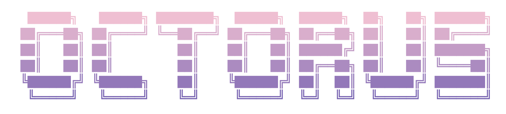

# octorus

<p align="center">
  
</p>

[](https://crates.io/crates/octorus)
[](https://opensource.org/licenses/MIT)

[日本語](./README-jp.md)

View and review GitHub PR diffs and local diffs exceeding 6,000 files and 300,000 lines — right in your terminal. Two AI agents automatically review and iterate on corrections until approval.

## Features

### Performance
- Fast startup with intelligent caching
- Tested with 6,000+ files and 300,000+ lines

### AI Rally
Automated PR review and fix cycle using AI agents. A reviewer agent analyzes diffs and posts comments, then a reviewee agent fixes issues and commits — looping until approved.

### Local Diff Mode
Preview local `git diff HEAD` in real time with file watcher — no PR required. Toggle between PR mode and Local mode on the fly (`L` key).

### PR Review
- Split view with file list and diff preview
- Syntax highlighting with powered by tree-sitter
- Add inline comments and code suggestions on specific lines
- View and navigate review comments with jump-to-line
- Submit reviews (Approve / Request Changes / Comment)
- Vim-like symbol search(`gd`), on-the-fly file display and editing(`gf`)
- Git log view for browsing PR commits with diff preview
- CI checks status display with workflow details

### Customization
- Fully configurable keybindings and editor
- Customizable AI-Rally prompt templates
- Customizable with any syntax highlighting theme.

## Requirements

- [GitHub CLI (gh)](https://cli.github.com/) - Must be installed and authenticated
- Rust 1.70+ (for building from source)
- **For AI Rally feature** (optional, choose one or both):
  - [Claude Code](https://claude.ai/code) - Anthropic's CLI tool
  - [OpenAI Codex CLI](https://github.com/openai/codex) - OpenAI's CLI tool

## Installation

```bash
cargo install octorus
```

Or install via [mise](https://mise.jdx.dev/):

```bash
mise use -g github:ushironoko/octorus
```

Or build from source:

```bash
git clone https://github.com/ushironoko/octorus.git
cd octorus
cargo build --release
cp target/release/or ~/.local/bin/
```

## Usage

```bash
# 1. Initialize config (recommended for AI Rally)
or init

# 2. Open PR list for current repository (auto-detected from git remote)
or

# 3. Open specific PR
or --repo owner/repo --pr 123

# 4. Start AI Rally (select PR from list, then auto-start)
or --ai-rally

# 5. Run AI Rally in headless mode (no TUI, CI/CD friendly)
or --repo owner/repo --pr 123 --ai-rally

# 6. Run headless AI Rally on local diff
or --local --ai-rally

# 7. Preview local working tree diff in real time
or --local
```

### Options

| Option | Description |
|--------|-------------|
| `-r, --repo <REPO>` | Repository name (e.g., "owner/repo") |
| `-p, --pr <PR>` | Pull request number |
| `--ai-rally` | Start AI Rally mode directly (headless when combined with `--pr` or `--local`) |
| `--working-dir <DIR>` | Working directory for AI agents (default: current directory) |
| `--local` | Show local git diff against current `HEAD` (no GitHub PR fetch) |
| `--auto-focus` | In local mode, automatically focus the changed file when diff updates |
| `--accept-local-overrides` | Accept local `.octorus/` overrides for AI settings in headless mode |

### Subcommands

| Subcommand | Description |
|------------|-------------|
| `or init` | Initialize global configuration files, prompt templates, and agent SKILL.md |
| `or init --local` | Initialize project-local `.octorus/` config and prompts |
| `or init --force` | Overwrite existing configuration files |
| `or clean` | Remove AI Rally session data |

`or init` creates global config:
- `~/.config/octorus/config.toml` - Main configuration file
- `~/.config/octorus/prompts/` - Prompt template directory
- `~/.claude/skills/octorus/SKILL.md` - Agent skill documentation (if `~/.claude/` exists)

`or init --local` creates project-local config:
- `.octorus/config.toml` - Project-local configuration (overrides global)
- `.octorus/prompts/` - Project-local prompt templates

## AI Rally

AI Rally is an automated PR review and fix cycle that uses two AI agents:

- **Reviewer**: Analyzes the PR diff and provides review feedback
- **Reviewee**: Fixes issues based on the review feedback and commits changes

### How it works

```
┌─────────────────┐
│  Start Rally    │  Press 'A' in File List View
└────────┬────────┘
         ▼
┌─────────────────┐
│    Reviewer     │  AI reviews the PR diff
│ (Claude/Codex)  │  → Posts review comments to PR
└────────┬────────┘
         │
    ┌────┴────┐
    │ Approve?│
    └────┬────┘
     No  │  Yes ──→ Done ✓
         ▼
┌─────────────────┐
│    Reviewee     │  AI fixes issues
│ (Claude/Codex)  │  → Commits locally (no push by default)
└────────┬────────┘
         │
    ┌────┴──────────────┐
    │                   │
    ▼                   ▼
 Completed    NeedsClarification /
    │          NeedsPermission
    │                   │
    │          User responds (y/n)
    │                   │
    └─────────┬─────────┘
              ▼
┌───────────────────────┐
│  Re-review (Reviewer) │  Updated diff:
│                       │  git diff (local) or
│                       │  gh pr diff (if pushed)
└───────────┬───────────┘
            │
       ┌────┴────┐
       │ Approve?│  ... repeat until approved
       └─────────┘       or max iterations
```

### Headless Mode (CI/CD)

When `--ai-rally` is combined with `--pr` or `--local`, AI Rally runs in **headless mode** — no TUI is launched, all output goes to stderr, and the process exits with a code suitable for CI/CD pipelines.

```bash
# Headless rally on a specific PR
or --repo owner/repo --pr 123 --ai-rally

# Headless rally on local diff
or --local --ai-rally

# With custom working directory
or --repo owner/repo --pr 123 --ai-rally --working-dir /path/to/repo
```

**JSON output** (stdout):

Headless mode writes a JSON object to stdout on completion:

```json
{
  "result": "Approved",
  "iterations": 2,
  "summary": "All issues resolved",
  "last_review": { ... },
  "last_fix": { ... }
}
```

| Field | Type | Description |
|-------|------|-------------|
| `result` | `"Approved"` / `"NotApproved"` / `"Error"` | Final outcome |
| `iterations` | number | Number of review-fix iterations completed |
| `summary` | string | Human-readable summary |
| `last_review` | object \| null | Last reviewer output (if available) |
| `last_fix` | object \| null | Last reviewee output (if available) |

**Exit codes:**

| Code | Meaning |
|------|---------|
| `0` | Reviewer approved |
| `1` | Not approved (request changes, error, or abort) |

**Headless policy** (no human interaction possible):

| Situation | Behavior |
|-----------|----------|
| Clarification needed | Auto-skip (agent proceeds with best judgment) |
| Permission needed | Auto-deny (prevents dynamic tool expansion) |
| Post confirmation | Auto-approve (posts review/fix to PR) |
| Agent text/thinking | Suppressed (prevents JSON leakage to stdout) |

**CI/CD example (GitHub Actions):**

```yaml
- name: AI Rally Review
  run: |
    or --repo ${{ github.repository }} --pr ${{ github.event.pull_request.number }} --ai-rally
```

### Features

- **PR Integration**: Review comments are automatically posted to the PR
- **External Bot Support**: Collects feedback from Copilot, CodeRabbit, and other bots
- **Safe Operations**: Dangerous git operations (`--force`, `reset --hard`) are prohibited
- **Session Persistence**: Rally state is saved locally and can be resumed
- **Interactive Flow**: When the AI agent needs clarification or permission, you can respond interactively
- **Local Diff Support**: Re-review iterations prioritize local `git diff` for unpushed changes; falls back to `gh pr diff` when changes have been pushed
- **Pause/Resume**: Press `p` to pause the rally at the next checkpoint (between iterations). Press `p` again to resume. The header shows `(Pausing...)` while waiting and `(PAUSED)` when stopped
- **Background Execution**: Press `b` to run rally in background while continuing to browse files
- **Auto Post**: Set `auto_post = true` in `[ai]` config to skip confirmation prompts and automatically post review/fix comments to the PR

### Recommended Configuration

Codex uses sandbox mode and cannot control tool permissions at a fine-grained level.
For maximum security, we recommend:

| Role | Recommended | Reason |
|------|-------------|--------|
| Reviewer | Codex or Claude | Read-only operations, both are safe |
| Reviewee | **Claude** | Allows fine-grained tool control via allowedTools |

Example configuration for secure setup:

```toml
[ai]
reviewer = "codex"   # Safe: read-only sandbox
reviewee = "claude"  # Recommended: fine-grained tool control
reviewee_additional_tools = ["Skill"]  # Add only what you need
```

**Note**: If you use Codex as reviewee, it runs in `--full-auto` mode with
workspace write access and no tool restrictions.

### Tool Permissions

#### Default Allowed Tools

**Reviewer** (read-only operations):

| Tool | Description |
|------|-------------|
| Read, Glob, Grep | File reading and searching |
| `gh pr view/diff/checks` | View PR information |
| `gh api --method GET` | GitHub API (GET only) |

**Reviewee** (code modification):

| Category | Commands |
|----------|----------|
| File | Read, Edit, Write, Glob, Grep |
| Git | status, diff, add, commit, log, show, branch, switch, stash |
| GitHub CLI | pr view, pr diff, pr checks, api GET |
| Cargo | build, test, check, clippy, fmt, run |
| npm/pnpm/bun | install, test, run |

#### Additional Tools (Claude only)

Additional tools can be enabled via config using Claude Code's `--allowedTools` format:

| Example | Description |
|---------|-------------|
| `"Skill"` | Execute Claude Code skills |
| `"WebFetch"` | Fetch URL content |
| `"WebSearch"` | Web search |
| `"Bash(git push:*)"` | git push to remote |
| `"Bash(gh api --method POST:*)"` | GitHub API POST requests |

```toml
[ai]
reviewee_additional_tools = ["Skill", "Bash(git push:*)"]
```

**Breaking Change (v0.2.0)**: `git push` is now disabled by default.
To enable, add `"Bash(git push:*)"` to `reviewee_additional_tools`.

## Local Diff Mode

Local Diff Mode lets you preview your uncommitted changes (`git diff HEAD`) directly in the TUI — no pull request required. A file watcher detects changes in real time and refreshes the diff automatically.

### Starting Local Diff Mode

```bash
# Start in local diff mode
or --local

# With auto-focus: automatically jump to the changed file on each update
or --local --auto-focus
```

### Real-Time File Watching

When running in local mode, octorus watches your working directory for file changes (ignoring `.git/` internals and access-only events). As soon as you save a file, the diff view updates automatically.

### Auto-Focus

When `--auto-focus` is enabled (or toggled with `F`), octorus automatically selects and focuses the file that changed most recently. If you're in the file list, it transitions to the split view diff. The selection algorithm picks the nearest changed file relative to your current cursor position.

The header displays `[LOCAL]` in local mode, or `[LOCAL AF]` when auto-focus is active.

### Switching Between PR and Local Mode

You can toggle between PR mode and Local mode at any time by pressing `L`:

```
PR mode ──[L]──► Local mode
  │                │
  │  UI state is   │  Starts file watcher
  │  saved/restored│  Shows git diff HEAD
  │                │
Local mode ──[L]──► PR mode
```

Your UI state (selected file, scroll position) is preserved across mode switches. If you started from a PR, pressing `L` in local mode returns you to that PR with its cached data.

### Differences from PR Mode

The following features are **disabled** in local mode since there is no associated pull request:

| Feature | Available? |
|---------|-----------|
| Browse changed files | ✅ |
| Syntax-highlighted diff | ✅ |
| Split view | ✅ |
| Go to definition (`gd`) | ✅ |
| Open file in editor (`gf`) | ✅ |
| Add inline comments | ❌ |
| Add suggestions | ❌ |
| Submit reviews | ❌ |
| View comment list | ❌ |
| View CI checks (`S`) | ❌ |
| Open PR in browser (`O`) | ❌ |

## Configuration

### Global Configuration

Run `or init` to create default config files, or create `~/.config/octorus/config.toml` manually:

```toml
# Editor for writing review body.
# Resolved in order: this value → $VISUAL → $EDITOR → vi
# Supports arguments: editor = "code --wait"
# editor = "vim"

[diff]
# Syntax highlighting theme for diff view
# See "Theme" section below for available options
theme = "base16-ocean.dark"
# Number of spaces per tab character in diff view (minimum: 1)
tab_width = 4
# Show background color on added/removed lines (default: true)
# bg_color = false

[keybindings]
# See "Configurable Keybindings" section below for all options
approve = "a"
request_changes = "r"
comment = "c"
suggestion = "s"

[git_log]
# Maximum number of cached commit diffs (default: 20)
max_diff_cache = 20

[ai]
# AI agent to use for reviewer/reviewee
# Supported: "claude" (Claude Code), "codex" (OpenAI Codex CLI)
reviewer = "claude"
reviewee = "claude"

# Maximum iterations before stopping
max_iterations = 10

# Timeout per agent execution (seconds)
timeout_secs = 600

# Custom prompt directory (default: ~/.config/octorus/prompts/)
# prompt_dir = "/custom/path/to/prompts"

# Additional tools for reviewer (Claude only)
# Use Claude Code's --allowedTools format
# reviewer_additional_tools = []

# Additional tools for reviewee (Claude only)
# Examples: "Skill", "WebFetch", "WebSearch", "Bash(git push:*)"
# reviewee_additional_tools = ["Skill", "Bash(git push:*)"]

# Auto-post review/fix comments to PR without confirmation prompt
# Default is false (asks for confirmation before posting)
# auto_post = true
```

### Project-Local Configuration

You can create project-local configuration under `.octorus/` in your repository root. This allows per-project settings that can be shared with your team via version control.

```bash
or init --local
```

This generates:

```
.octorus/
├── config.toml        # Project-local config (overrides global)
└── prompts/
    ├── reviewer.md    # Project-specific reviewer prompt
    ├── reviewee.md    # Project-specific reviewee prompt
    └── rereview.md    # Project-specific re-review prompt
```

**Override behavior**: Local values are deep-merged on top of global config. Only specify keys you want to override — unspecified keys inherit from global config.

```toml
# .octorus/config.toml — only override what you need
[ai]
max_iterations = 5
timeout_secs = 300
```

**Prompt resolution order** (highest priority first):
1. `.octorus/prompts/` (project-local)
2. `ai.prompt_dir` (custom directory from config)
3. `~/.config/octorus/prompts/` (global)
4. Built-in defaults

> **Warning**: When you clone or fork a repository that contains `.octorus/`, be aware that those settings were chosen by the repository owner — not by you. octorus applies the following safeguards to protect you:
>
> - **`editor` is always ignored** in local config. It cannot be set per-project.
> - **AI-related settings** (`ai.reviewer`, `ai.reviewee`, `ai.*_additional_tools`, `ai.auto_post`) and **local prompt files** will trigger a confirmation dialog before AI Rally starts. In headless mode, you must explicitly pass `--accept-local-overrides` to allow them.
> - **`ai.prompt_dir`** cannot use absolute paths or `..` in local config.
> - Symlinks under `.octorus/prompts/` are not followed.

### Customizing Prompt Templates

AI Rally uses customizable prompt templates. Run `or init` to generate default templates, then edit them as needed:

```
~/.config/octorus/prompts/
├── reviewer.md    # Prompt for the reviewer agent
├── reviewee.md    # Prompt for the reviewee agent
└── rereview.md    # Prompt for re-review iterations
```

Templates support variable substitution with `{{variable}}` syntax:

| Variable | Description | Available In |
|----------|-------------|--------------|
| `{{repo}}` | Repository name (e.g., "owner/repo") | All |
| `{{pr_number}}` | Pull request number | All |
| `{{pr_title}}` | Pull request title | All |
| `{{pr_body}}` | Pull request description | reviewer |
| `{{diff}}` | PR diff content | reviewer |
| `{{iteration}}` | Current iteration number | All |
| `{{review_summary}}` | Summary from reviewer | reviewee |
| `{{review_action}}` | Review action (Approve/RequestChanges/Comment) | reviewee |
| `{{review_comments}}` | List of review comments | reviewee |
| `{{blocking_issues}}` | List of blocking issues | reviewee |
| `{{external_comments}}` | Comments from external tools | reviewee |
| `{{changes_summary}}` | Summary of changes made | rereview |
| `{{updated_diff}}` | Updated diff after fixes | rereview |

### Theme

The `[diff]` section's `theme` option controls the syntax highlighting color scheme in the diff view.

#### Built-in Themes

| Theme | Description |
|-------|-------------|
| `base16-ocean.dark` | Dark theme based on Base16 Ocean (default) |
| `base16-ocean.light` | Light theme based on Base16 Ocean |
| `base16-eighties.dark` | Dark theme based on Base16 Eighties |
| `base16-mocha.dark` | Dark theme based on Base16 Mocha |
| `Dracula` | Dracula color scheme |
| `InspiredGitHub` | Light theme inspired by GitHub |
| `Solarized (dark)` | Solarized dark |
| `Solarized (light)` | Solarized light |

```toml
[diff]
theme = "Dracula"
```

Theme names are **case-insensitive** (`dracula`, `Dracula`, and `DRACULA` all work).

If a specified theme is not found, it falls back to `base16-ocean.dark`.

#### Custom Themes

You can add custom themes by placing `.tmTheme` (TextMate theme) files in `~/.config/octorus/themes/`:

```
~/.config/octorus/themes/
├── MyCustomTheme.tmTheme
└── nord.tmTheme
```

The filename (without `.tmTheme` extension) becomes the theme name:

```toml
[diff]
theme = "MyCustomTheme"
```

Custom themes with the same name as a built-in theme will override it.

## Keybindings

### PR List View

| Key | Action |
|-----|--------|
| `j` / `↓` | Move down |
| `k` / `↑` | Move up |
| `Shift+j` | Page down |
| `Shift+k` | Page up |
| `gg` | Jump to first |
| `G` | Jump to last |
| `Enter` | Select PR |
| `o` | Filter: Open PRs only |
| `c` | Filter: Closed PRs only |
| `a` | Filter: All PRs |
| `O` | Open PR in browser |
| `S` | View CI checks status |
| `Space /` | Keyword filter |
| `R` | Refresh PR list |
| `L` | Toggle local diff mode |
| `?` | Toggle help |
| `q` | Quit |

PRs are loaded with infinite scroll — additional PRs are fetched automatically as you scroll down. The header shows the current state filter (open/closed/all).

### File List View

| Key | Action |
|-----|--------|
| `j` / `↓` | Move down |
| `k` / `↑` | Move up |
| `Shift+j` | Page down |
| `Shift+k` | Page up |
| `Enter` / `→` / `l` | Open split view |
| `v` | Mark file as viewed/unviewed |
| `V` | Mark directory as viewed |
| `a` | Approve PR |
| `r` | Request changes |
| `c` | Comment only |
| `C` | View review comments |
| `R` | Force refresh (discard cache) |
| `d` | View PR description |
| `A` | Start AI Rally |
| `S` | View CI checks status |
| `gl` | Open git log view |
| `I` | Open issue list |
| `Space /` | Keyword filter |
| `L` | Toggle local diff mode |
| `F` | Toggle auto-focus (local mode) |
| `?` | Toggle help |
| `q` | Quit |

### Split View

The split view shows the file list (left, 35%) and a diff preview (right, 65%). The focused pane is highlighted with a yellow border.

**File List Focus:**

| Key | Action |
|-----|--------|
| `j` / `↓` | Move file selection (diff follows) |
| `k` / `↑` | Move file selection (diff follows) |
| `Enter` / `→` / `l` | Focus diff pane |
| `←` / `h` / `q` | Back to file list |

**Diff Focus:**

| Key | Action |
|-----|--------|
| `j` / `↓` | Scroll diff |
| `k` / `↑` | Scroll diff |
| `gd` | Go to definition |
| `gf` | Open file in $EDITOR |
| `gg` / `G` | Jump to first/last line |
| `Ctrl-o` | Jump back |
| `Ctrl-d` | Page down |
| `Ctrl-u` | Page up |
| `n` | Jump to next comment |
| `N` | Jump to previous comment |
| `c` | Add comment at line |
| `s` | Add suggestion at line |
| `Shift+Enter` | Enter multiline selection mode |
| `Enter` | Open comment panel |
| `Tab` / `→` / `l` | Open fullscreen diff view |
| `←` / `h` | Focus file list |
| `q` | Back to file list |

### Diff View

| Key | Action |
|-----|--------|
| `j` / `↓` | Move down |
| `k` / `↑` | Move up |
| `gd` | Go to definition |
| `gf` | Open file in $EDITOR |
| `gg` / `G` | Jump to first/last line |
| `Ctrl-o` | Jump back |
| `n` | Jump to next comment |
| `N` | Jump to previous comment |
| `Ctrl-d` | Page down |
| `Ctrl-u` | Page up |
| `c` | Add comment at line |
| `s` | Add suggestion at line |
| `Shift+Enter` / `V` | Enter multiline selection mode |
| `M` | Toggle Markdown rich display |
| `Enter` | Open comment panel |
| `←` / `h` / `q` / `Esc` | Back to previous view |

**Go to Definition (`gd`)**: When multiple symbol candidates are found, a popup appears for selection. Use `j`/`k` to navigate, `Enter` to jump, `Esc` to cancel. The jump stack (`Ctrl-o` to go back) stores up to 100 positions.

**Note**: Lines with existing comments are marked with `●`. When you select a commented line, the comment content is displayed in a panel below the diff.

**Multiline Selection Mode:**

Press `Shift+Enter` to enter multiline selection mode. Select a range of lines, then create a comment or suggestion spanning the entire range.

| Key | Action |
|-----|--------|
| `j` / `↓` | Extend selection down |
| `k` / `↑` | Extend selection up |
| `Enter` / `c` | Comment on selection |
| `s` | Suggest on selection |
| `Esc` | Cancel selection |

**Comment Panel (when focused):**

| Key | Action |
|-----|--------|
| `j` / `k` | Scroll panel |
| `c` | Add comment |
| `s` | Add suggestion |
| `r` | Reply to comment |
| `Tab` / `Shift-Tab` | Select reply target |
| `n` / `N` | Jump to next/prev comment |
| `Esc` / `q` | Close panel |

### Input Mode (Comment/Suggestion/Reply)

When adding a comment, suggestion, or reply, you enter the built-in text input mode:

| Key | Action |
|-----|--------|
| `Ctrl+S` | Submit |
| `Esc` | Cancel |

Multi-line input is supported. Press `Enter` to insert a newline.

### Git Log View

The git log view lets you browse PR commits with syntax-highlighted diff preview.

**Commit List Focus (Split View):**

| Key | Action |
|-----|--------|
| `j` / `↓` | Move down in commit list |
| `k` / `↑` | Move up in commit list |
| `Shift+j` | Page down |
| `Shift+k` | Page up |
| `g` | Jump to first commit |
| `G` | Jump to last commit |
| `Enter` / `Tab` / `→` / `l` | Focus diff pane |
| `r` | Retry (on error) |
| `q` / `Esc` / `←` / `h` | Back to file list |

**Diff Focus (Split View):**

| Key | Action |
|-----|--------|
| `j` / `↓` | Scroll diff |
| `k` / `↑` | Scroll diff |
| `gg` / `G` | Jump to first/last line |
| `Ctrl-d` | Page down |
| `Ctrl-u` | Page up |
| `Tab` / `→` / `l` | Open fullscreen diff view |
| `←` / `h` | Focus commit list |
| `q` | Back to file list |

Commits are loaded with infinite scroll — additional commits are fetched automatically as you scroll down. Diffs are prefetched in the background for faster navigation.

### CI Checks View

| Key | Action |
|-----|--------|
| `j` / `↓` | Move down |
| `k` / `↑` | Move up |
| `Enter` | Open check in browser |
| `R` | Refresh check list |
| `O` | Open PR in browser |
| `?` | Toggle help |
| `q` / `Esc` | Back to previous view |

Status icons: `✓` (pass), `✕` (fail), `○` (pending), `-` (skipped/cancelled). Each check shows its name, workflow, and duration.

### Comment List View

| Key | Action |
|-----|--------|
| `j` / `↓` | Move down |
| `k` / `↑` | Move up |
| `Enter` | Jump to file/line |
| `q` / `Esc` | Back to file list |

### AI Rally View

| Key | Action |
|-----|--------|
| `j` / `↓` | Move down in log |
| `k` / `↑` | Move up in log |
| `Enter` | Show log detail |
| `g` | Jump to top |
| `G` | Jump to bottom |
| `b` | Run in background (return to file list) |
| `y` | Grant permission / Enter clarification |
| `n` | Deny permission / Skip clarification |
| `p` | Pause / Resume rally |
| `r` | Retry (on error) |
| `q` / `Esc` | Abort and exit rally |

### Configurable Keybindings

All keybindings can be customized in the `[keybindings]` section. Three formats are supported:

```toml
[keybindings]
# Simple key
move_down = "j"

# Key with modifiers
page_down = { key = "d", ctrl = true }

# Two-key sequence
go_to_definition = ["g", "d"]
```

#### Available Keybindings

| Key | Default | Description |
|-----|---------|-------------|
| **Navigation** |||
| `move_down` | `j` | Move down |
| `move_up` | `k` | Move up |
| `move_left` | `h` | Move left / back |
| `move_right` | `l` | Move right / select |
| `page_down` | `Ctrl+d` | Page down |
| `page_up` | `Ctrl+u` | Page up |
| `jump_to_first` | `gg` | Jump to first line |
| `jump_to_last` | `G` | Jump to last line |
| `jump_back` | `Ctrl+o` | Jump to previous position |
| `next_comment` | `n` | Jump to next comment |
| `prev_comment` | `N` | Jump to previous comment |
| **Actions** |||
| `approve` | `a` | Approve PR |
| `request_changes` | `r` | Request changes |
| `comment` | `c` | Add comment |
| `suggestion` | `s` | Add suggestion |
| `reply` | `r` | Reply to comment |
| `refresh` | `R` | Force refresh |
| `submit` | `Ctrl+s` | Submit input |
| **Mode Switching** |||
| `quit` | `q` | Quit / back |
| `help` | `?` | Toggle help |
| `comment_list` | `C` | Open comment list |
| `ai_rally` | `A` | Start AI Rally |
| `open_panel` | `Enter` | Open panel / select |
| `open_in_browser` | `O` | Open PR in browser |
| `ci_checks` | `S` | View CI checks status |
| `git_log` | `gl` | Open git log view |
| `issue_list` | `I` | Open issue list |
| `toggle_local_mode` | `L` | Toggle local diff mode |
| `toggle_auto_focus` | `F` | Toggle auto-focus (local mode) |
| `toggle_markdown_rich` | `M` | Toggle Markdown rich display |
| `pr_description` | `d` | View PR description |
| **Diff Operations** |||
| `go_to_definition` | `gd` | Go to definition |
| `go_to_file` | `gf` | Open file in $EDITOR |
| `multiline_select` | `V` | Enter multiline selection mode |
| **List Operations** |||
| `filter` | `Space /` | Keyword filter (PR list / file list) |

### Keyword Filter

Press `Space /` in the PR list or file list to activate keyword filtering. Type to filter items by name.

| Key | Action |
|-----|--------|
| Characters | Filter by keyword |
| `Backspace` | Delete character |
| `Ctrl+u` | Clear filter text |
| `↑` / `↓` | Navigate filtered results |
| `Enter` | Confirm selection |
| `Esc` | Cancel filter |

**Note**: Arrow keys (`↑/↓/←/→`) always work as alternatives to Vim-style keys and cannot be remapped.

## License

MIT
